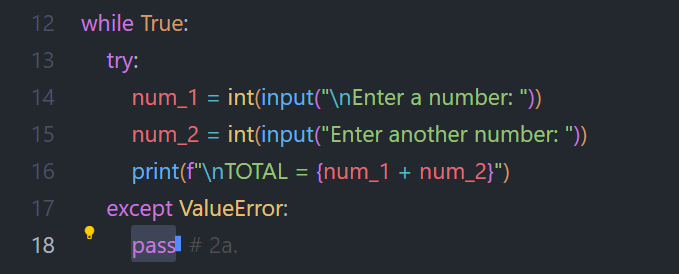
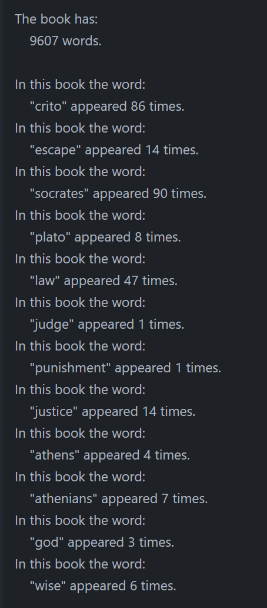
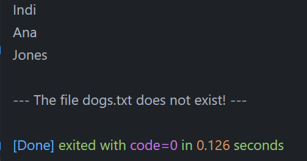
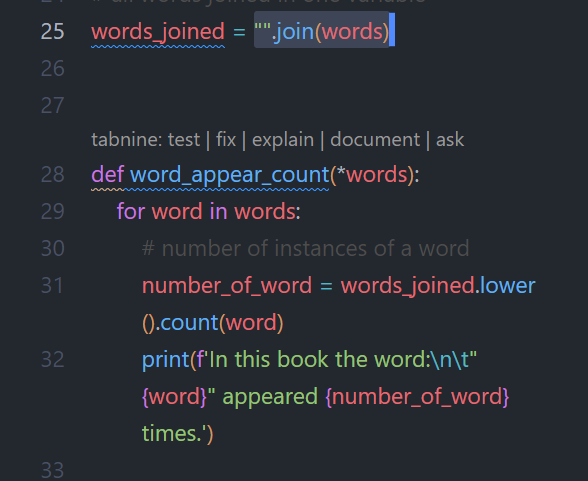

# WHAT I LEARNT

---

## The try/except Block

The **try/except block** was hard to grasp from the couple of videos I watched about it. None of them really mentioned the important role of **external 'sources'**, which mostly are: 
- user inputs, 
- project files 
- and network connections

And also try/except plays an important part in **securing the code**. As a developer, this is something to always keep in mind and watch out. 

Other than these points, the syntax is easy to use, nothing complicated here.  

And the error to pass after the `except` can easily be copy/pasted from the traceback error message.  

The other functionality of try/except is that it **can still be optional** even if used, with the `pass` method in the body of the except. 

Here the `pass` keeps the **error handling silent**. The user won't know about it, and he'd just keep on inputting numbers, even if only letters are typed in. 

---

## Read & Write

The `pathlib` library has methods like `read_text()` and `write_text()` that are self-explanatory. They are used with other methods to **manipulate contents of documents**. I played with the `.split()`, `splitlines()`, and `.count()` methods.  
The things that can be done with books and documents... 

### Beware of rewriting your file

The `write_text()` method, if the file it is writing on already exists, is constantly rewriting the file. So **be sure of your file names**, otherwise you **may be rewriting one of them** without knowing it. 

### The Importance of the Project's Folders Structure

But when working with these pathlib tools, the file path is essential. The **relative path** is for documents that are "close" to the project main files, meaning right in the same folder or one up.  
And if this is not a working option, then the **absolute path** will always works. 

--- 

## Fun with Books

This exercise 10-10 was fun. I searched for counts of given words in a book. 

I just watched a video about the philosopher Socrates (even if he did not consider himself a philosopher, or rather a 'wise man'.) And I learnt about this book named after a friend of him, and also the name of that book: Crito.  
Given the age of the book (about 2200 years old), I was pretty sure it was available in Gutenberg.org. 

Anyway, I knew the story of the book: his friend trying to help him escape. So I wanted to see how many times the word 'escape' appears in the book. To my disappointment, only 14 times. 

Of course I tried many other words: 

--- 

## How Well Did I do?

After I compared my code to the solutions: 
- **exercise 10-6**:  
  The solutions did not use the int() method on the variable that holds the input value. It used it on a new line, to add readability I guess. On a simple program like this one I suppose this is a better route. But the opposite could be true too.

  Using the new line uses 8 characters to be added and a new line as well. The int() method is using a net 5 characters. So the difference is 3 characters added. 
  But in my example, my inputs are not called 'x' and 'y' but 'num1' and 'num2'.  
  This makes me go back and modify my code...  
  So the decision is not that cut out for me... So I'll just stick to my initial code. 

  GRADE:   
  IMHO it's a pass. 

- **exercise 10-7**:  
  I anticipated, without knowing it, this exercise in the previous one. I use a while loop on it already.  
  But no 'quit' option here, just an endless program.  

  Also, I used the `pass`  method i nthe body of the `except:` to make it silent. The solution code did not use but I thought this was what was requested in the instructions.  
  This made me think and, as is, **my code is not user friendly**. If a letter is typed, nothing tells you it is not right. So this is **a mistake on me**. 

  **Ease of use is important** because it drives the usability of a program. The easier to use, the more the program is appreciated and used. This is something I need to always be watching. 

  GRADE:  Fail. 

- **exercise 10-8**:
  
  The solution code is better: more concise than mine. **I made it way more complicated** than it needed to be. 

  GRADE: pass but to be revisited. 

  

- **exercise 10-10**:
  
  So my first approach was to get the list of words from the `.count()` method and use a for loop with inside it an `if word == "something":` but that did not work because each item in the list is a string that also contains special characters like a comma, exclamation mark or ":" and dot.  
  The count numbers returned were not nearly close enough (I checked with a simple search directly in the text file of the book). 

  After about an hour, I thought about the `.join()` method and it worked perfectly. The numbers are correct. 

  

  Also, while the solution code did not use it, I used the `write_text()` method to write the names in each cats and dogs file. 

  GRADE: hig pass.

---

#### Resources:
Python Crash Course 3rd Ed.: [solutions to exercises 10-6 to 10-10](https://ehmatthes.github.io/pcc_3e/solutions/chapter_10/#10-6-addition)  
Gutenberg library: [Crito book](https://gutenberg.org/ebooks/1657) 